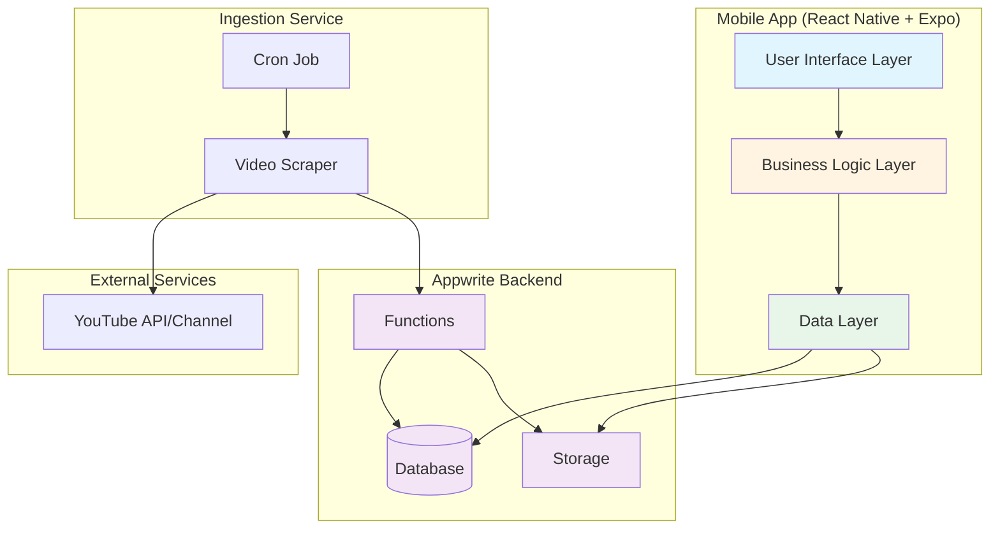

# Design Document: Naat Platform

## Overview

The Naat Platform is a React Native mobile application built with Expo that provides users with a streamlined experience for browsing and watching naat videos from a single reciter. The application follows a client-server architecture where the mobile app (client) consumes data from Appwrite (backend), which is populated by an automated ingestion service that fetches content from YouTube.

### Technology Stack

- **Frontend**: React Native with Expo (v54), TypeScript
- **Styling**: NativeWind (Tailwind CSS for React Native)
- **Navigation**: Expo Router (file-based routing)
- **Backend**: Appwrite (Database, Storage, Functions)
- **Video Playback**: React Native video player library
- **State Management**: React Context API with hooks
- **Local Storage**: AsyncStorage for playback positions

### Design Principles

1. **Simplicity First**: Minimize cognitive load with clear, focused UI
2. **Performance**: Optimize for smooth scrolling and quick video loading
3. **Offline Resilience**: Cache data and handle network failures gracefully
4. **Scalability**: Design with future multi-reciter support in mind
5. **Accessibility**: Ensure readable text and intuitive navigation

## Architecture

### High-Level Architecture



### Application Layers

#### 1. User Interface Layer

- Screen components (Home, Player, Search)
- Reusable UI components (NaatCard, VideoPlayer, SearchBar)
- Navigation structure using Expo Router

#### 2. Business Logic Layer

- Custom hooks for data fetching and state management
- Video playback logic
- Search and filtering logic
- Playback position tracking

#### 3. Data Layer

- Appwrite SDK integration
- API service modules
- Local storage management
- Data caching strategies

## Components and Interfaces

### Mobile App Components

#### Screen Components

**HomeScreen** (`app/index.tsx`)

- Displays list of naats with infinite scroll
- Integrates search functionality
- Shows loading states and error messages
- Handles pull-to-refresh

**PlayerScreen** (`app/player/[id].tsx`)

- Full-screen video player
- Playback controls (play, pause, seek, fullscreen)
- Resume playback prompt
- Error handling for failed video loads

#### Reusable Components

**NaatCard** (`components/NaatCard.tsx`)

```typescript
interface NaatCardProps {
  id: string;
  title: string;
  thumbnail: string;
  duration: number;
  uploadDate: string;
  reciterName: string;
  onPress: () => void;
}
```

- Displays naat thumbnail, title, duration, and metadata
- Handles thumbnail loading errors with placeholder
- Optimized for list rendering

**VideoPlayer** (`components/VideoPlayer.tsx`)

```typescript
interface VideoPlayerProps {
  videoUrl: string;
  initialPosition?: number;
  onPositionChange: (position: number) => void;
  onComplete: () => void;
  onError: (error: Error) => void;
}
```

- Wraps video player library with custom controls
- Manages playback state
- Reports position changes for persistence

**SearchBar** (`components/SearchBar.tsx`)

```typescript
interface SearchBarProps {
  value: string;
  onChangeText: (text: string) => void;
  placeholder?: string;
}
```

- Debounced search input
- Clear button
- Accessible keyboard handling

**EmptyState** (`components/EmptyState.tsx`)

```typescript
interface EmptyStateProps {
  message: string;
  icon?: string;
  actionLabel?: string;
  onAction?: () => void;
}
```

- Displays when no content is available
- Supports custom messages and actions

**ErrorBoundary** (`components/ErrorBoundary.tsx`)

- Catches and displays React errors gracefully
- Provides retry mechanism

### Services and Hooks

#### Appwrite Service (`services/appwrite.ts`)

```typescript
class AppwriteService {
  private client: Client;
  private database: Databases;

  constructor(endpoint: string, projectId: string);

  async getNaats(limit: number, offset: number): Promise<Naat[]>;
  async getNaatById(id: string): Promise<Naat>;
  async searchNaats(query: string): Promise<Naat[]>;
}
```

#### Storage Service (`services/storage.ts`)

```typescript
interface PlaybackPosition {
  naatId: string;
  position: number;
  timestamp: number;
}

class StorageService {
  async savePlaybackPosition(naatId: string, position: number): Promise<void>;
  async getPlaybackPosition(naatId: string): Promise<number | null>;
  async clearPlaybackPosition(naatId: string): Promise<void>;
  async getRecentPositions(): Promise<PlaybackPosition[]>;
}
```

#### Custom Hooks

**useNaats** (`hooks/useNaats.ts`)

```typescript
interface UseNaatsReturn {
  naats: Naat[];
  loading: boolean;
  error: Error | null;
  hasMore: boolean;
  loadMore: () => void;
  refresh: () => Promise<void>;
}

function useNaats(): UseNaatsReturn;
```

**useSearch** (`hooks/useSearch.ts`)

```typescript
interface UseSearchReturn {
  query: string;
  results: Naat[];
  loading: boolean;
  setQuery: (query: string) => void;
  clearSearch: () => void;
}

function useSearch(): UseSearchReturn;
```

**usePlaybackPosition** (`hooks/usePlaybackPosition.ts`)

```typescript
interface UsePlaybackPositionReturn {
  savedPosition: number | null;
  savePosition: (position: number) => void;
  clearPosition: () => void;
}

function usePlaybackPosition(naatId: string): UsePlaybackPositionReturn;
```

### Backend Components (Appwrite)

#### Database Schema

**Naats Collection**

```typescript
interface Naat {
  $id: string;
  title: string;
  videoUrl: string;
  thumbnailUrl: string;
  duration: number; // in seconds
  uploadDate: string; // ISO 8601 format
  reciterName: string;
  reciterId: string;
  youtubeId: string;
  createdAt: string;
  updatedAt: string;
}
```

**Reciters Collection** (for future expansion)

```typescript
interface Reciter {
  $id: string;
  name: string;
  bio?: string;
  profileImage?: string;
  youtubeChannelId: string;
  createdAt: string;
}
```

#### Appwrite Functions

**Video Ingestion Function** (`functions/ingest-videos`)

- Triggered by cron schedule (e.g., daily at 2 AM)
- Fetches latest videos from YouTube channel
- Extracts metadata (title, URL, thumbnail, duration)
- Checks for duplicates using youtubeId
- Inserts new videos into Naats collection
- Logs errors for monitoring

```typescript
interface IngestionResult {
  processed: number;
  added: number;
  skipped: number;
  errors: string[];
}
```

## Data Models

### Core Data Types

```typescript
// Naat entity
type Naat = {
  $id: string;
  title: string;
  videoUrl: string;
  thumbnailUrl: string;
  duration: number;
  uploadDate: string;
  reciterName: string;
  reciterId: string;
  youtubeId: string;
  createdAt: string;
  updatedAt: string;
};

// API response wrapper
type ApiResponse<T> = {
  data: T;
  total?: number;
  error?: string;
};

// Pagination parameters
type PaginationParams = {
  limit: number;
  offset: number;
};

// Search parameters
type SearchParams = {
  query: string;
  limit?: number;
};
```

### State Management

The app uses React Context for global state:

```typescript
interface AppContextValue {
  naats: Naat[];
  loading: boolean;
  error: Error | null;
  refreshNaats: () => Promise<void>;
}

const AppContext = createContext<AppContextValue | undefined>(undefined);
```

## Error Handling

### Error Categories

1. **Network Errors**: Connection failures, timeouts
2. **API Errors**: Invalid responses, authentication issues
3. **Playback Errors**: Video loading failures, unsupported formats
4. **Storage Errors**: AsyncStorage failures

### Error Handling Strategy

```typescript
class AppError extends Error {
  constructor(
    message: string,
    public code: string,
    public recoverable: boolean = true
  ) {
    super(message);
  }
}

// Error codes
enum ErrorCode {
  NETWORK_ERROR = "NETWORK_ERROR",
  API_ERROR = "API_ERROR",
  PLAYBACK_ERROR = "PLAYBACK_ERROR",
  STORAGE_ERROR = "STORAGE_ERROR",
  UNKNOWN_ERROR = "UNKNOWN_ERROR",
}
```

### User-Facing Error Messages

- Network errors: "Unable to connect. Please check your internet connection."
- API errors: "Something went wrong. Please try again."
- Playback errors: "Unable to play video. Please try another naat."
- Empty state: "No naats available yet. Check back soon!"

### Retry Mechanisms

- Automatic retry for network requests (max 3 attempts with exponential backoff)
- Manual retry button for failed operations
- Cached data fallback when API is unavailable

## Testing Strategy

### Unit Tests

**Components**

- NaatCard rendering with various props
- SearchBar debouncing behavior
- EmptyState display logic

**Hooks**

- useNaats pagination and refresh logic
- useSearch filtering and debouncing
- usePlaybackPosition save/load operations

**Services**

- AppwriteService API calls with mocked responses
- StorageService AsyncStorage operations

### Integration Tests

- Home screen data loading and display
- Search functionality end-to-end
- Video playback with position saving
- Error handling flows

### Testing Tools

- Jest for unit tests
- React Native Testing Library for component tests
- Mock Service Worker (MSW) for API mocking

### Test Coverage Goals

- Minimum 70% code coverage
- 100% coverage for critical paths (data fetching, playback)
- All error scenarios tested

## Performance Optimizations

### List Rendering

- Use `FlatList` with `getItemLayout` for consistent item heights
- Implement `keyExtractor` for stable keys
- Use `removeClippedSubviews` for large lists
- Optimize `NaatCard` with `React.memo`

### Image Loading

- Use `expo-image` for optimized image caching
- Implement progressive image loading
- Preload thumbnails for next items in list

### Data Fetching

- Implement pagination (20 items per page)
- Cache API responses in memory
- Debounce search queries (300ms delay)
- Use stale-while-revalidate pattern

### Video Playback

- Preload video metadata when user scrolls near item
- Use adaptive bitrate streaming when available
- Implement buffer management

## Security Considerations

### API Security

- Store Appwrite credentials in environment variables
- Use Appwrite API keys with minimal required permissions
- Implement rate limiting on API calls

### Data Validation

- Validate all API responses before rendering
- Sanitize user input in search queries
- Validate video URLs before playback

### User Privacy

- Store playback positions locally only
- No personal data collection
- Clear privacy policy for YouTube content usage

## Deployment and Configuration

### Environment Variables

```typescript
// app.config.ts or .env
export default {
  APPWRITE_ENDPOINT: process.env.APPWRITE_ENDPOINT,
  APPWRITE_PROJECT_ID: process.env.APPWRITE_PROJECT_ID,
  APPWRITE_DATABASE_ID: process.env.APPWRITE_DATABASE_ID,
  APPWRITE_NAATS_COLLECTION_ID: process.env.APPWRITE_NAATS_COLLECTION_ID,
  YOUTUBE_CHANNEL_ID: process.env.YOUTUBE_CHANNEL_ID,
};
```

### Appwrite Setup

1. Create Appwrite project
2. Create database and collections (Naats, Reciters)
3. Set up indexes for search (title field)
4. Configure collection permissions (read-only for mobile app)
5. Deploy ingestion function with cron trigger
6. Set up YouTube API credentials for ingestion

### Build Configuration

- iOS: Configure bundle identifier and provisioning
- Android: Set up signing keys and permissions
- Both: Configure deep linking scheme for future sharing features

## Future Enhancements

### Phase 2 Features

- Multiple reciter support
- Favorites/bookmarks functionality
- Offline downloads
- Audio-only mode
- Playlists

### Scalability Considerations

- Design allows easy addition of new reciters
- Database schema supports categorization
- Component architecture supports feature expansion
- API design allows for filtering and advanced queries
