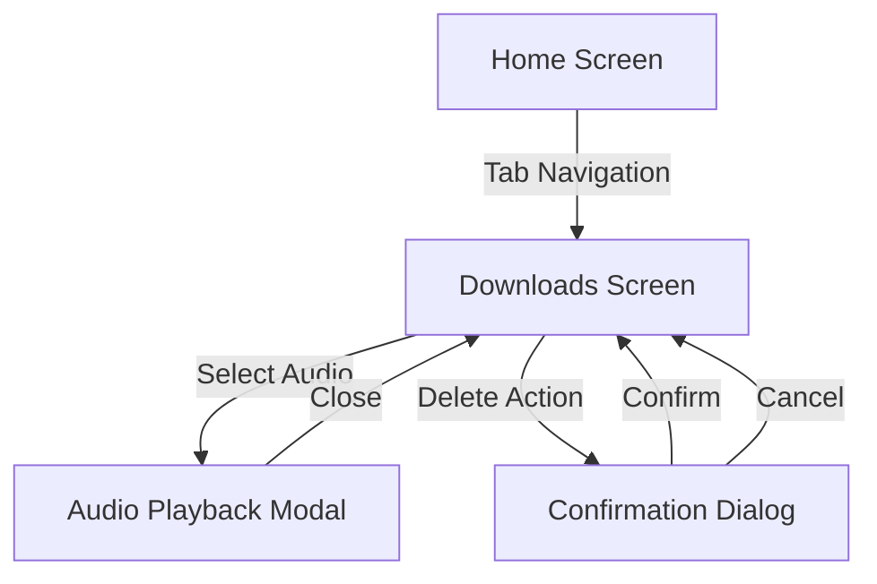
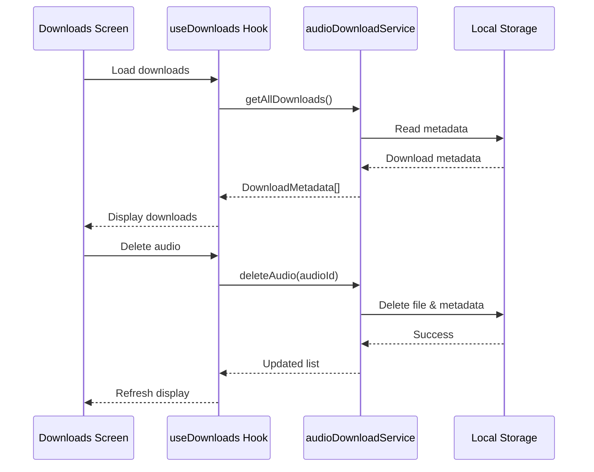

# Design Document

## Overview

The Offline Audio Library feature adds a new screen to the React Native app that displays and manages downloaded audio files. The design leverages the existing audioDownloadService for data management and the AudioPlayer component for playback, ensuring consistency with the current app architecture. The feature will be implemented as a new route in the expo-router navigation structure.

## Architecture

### Component Structure

```
app/
  downloads.tsx              # New downloads screen route
components/
  DownloadedAudioCard.tsx    # Card component for each downloaded item
  DownloadedAudioModal.tsx   # Modal for playing downloaded audio
  DownloadsHeader.tsx        # Header with storage info and actions
hooks/
  useDownloads.ts            # Custom hook for managing downloads state
utils/
  formatters.ts              # Utility functions for formatting file sizes and dates
```

### Navigation Flow



### Data Flow



## Components and Interfaces

### 1. Downloads Screen (app/downloads.tsx)

**Purpose:** Main screen component that displays the list of downloaded audio files.

**Props:** None (route component)

**State:**

- `selectedAudio: DownloadMetadata | null` - Currently selected audio for playback
- `modalVisible: boolean` - Controls playback modal visibility
- `searchQuery: string` - Search filter text
- `sortBy: 'date' | 'title'` - Current sort option
- `sortOrder: 'asc' | 'desc'` - Sort direction

**Key Methods:**

- `handleAudioPress(audio: DownloadMetadata)` - Opens playback modal
- `handleDelete(audioId: string)` - Initiates delete with confirmation
- `handleSearch(query: string)` - Filters downloads by search text
- `handleSort(sortBy, sortOrder)` - Changes sort order

**Layout:**

- SafeAreaView with header
- DownloadsHeader component showing storage stats
- Search bar for filtering
- Sort controls
- FlatList of DownloadedAudioCard components
- Empty state when no downloads
- DownloadedAudioModal for playback

### 2. DownloadedAudioCard Component

**Purpose:** Displays individual downloaded audio item with metadata and actions.

**Props:**

```typescript
interface DownloadedAudioCardProps {
  audio: DownloadMetadata;
  onPress: () => void;
  onDelete: () => void;
}
```

**Features:**

- Thumbnail image (from metadata or default)
- Title and channel name
- Download date (formatted as "Downloaded X days ago")
- File size (formatted as MB/GB)
- Delete button with icon
- Press handler for playback
- Swipe-to-delete gesture (optional enhancement)

**Styling:**

- Consistent with existing NaatCard component
- Dark theme matching app design
- Highlight on press
- Disabled state during operations

### 3. DownloadedAudioModal Component

**Purpose:** Modal wrapper for playing downloaded audio files.

**Props:**

```typescript
interface DownloadedAudioModalProps {
  visible: boolean;
  onClose: () => void;
  audio: DownloadMetadata;
}
```

**Features:**

- Full-screen modal presentation
- Close button in header
- AudioPlayer component with local file
- Audio metadata display
- Error handling for playback issues

**Implementation:**

- Reuses existing AudioPlayer component
- Passes local file URI from DownloadMetadata
- Sets isLocalFile prop to true
- Handles modal lifecycle (mount/unmount)

### 4. DownloadsHeader Component

**Purpose:** Header section showing storage information and bulk actions.

**Props:**

```typescript
interface DownloadsHeaderProps {
  totalSize: number;
  downloadCount: number;
  onClearAll?: () => void;
}
```

**Features:**

- Total storage used display
- Number of downloaded files
- "Clear All" button (optional)
- Formatted storage size (e.g., "125.5 MB")

### 5. useDownloads Hook

**Purpose:** Custom hook managing downloads state and operations.

**Interface:**

```typescript
interface UseDownloadsReturn {
  downloads: DownloadMetadata[];
  loading: boolean;
  error: Error | null;
  totalSize: number;
  refresh: () => Promise<void>;
  deleteAudio: (audioId: string) => Promise<void>;
  clearAll: () => Promise<void>;
}
```

**Implementation:**

- Fetches downloads on mount using audioDownloadService.getAllDownloads()
- Calculates total size using audioDownloadService.getTotalDownloadSize()
- Provides delete function wrapping audioDownloadService.deleteAudio()
- Handles loading and error states
- Implements refresh functionality
- Validates file existence during refresh

## Data Models

### Extended DownloadMetadata

The existing DownloadMetadata interface from audioDownloadService will be used:

```typescript
interface DownloadMetadata {
  audioId: string;
  youtubeId: string;
  title: string;
  localUri: string;
  downloadedAt: number;
  fileSize: number;
}
```

Additional computed properties in UI:

- `formattedSize: string` - Human-readable file size
- `formattedDate: string` - Relative download date
- `thumbnailUrl: string` - Derived from youtubeId or cached

### Sort Options

```typescript
type SortOption = "date-desc" | "date-asc" | "title-asc" | "title-desc";
```

## Error Handling

### Error Scenarios

1. **File Not Found**
   - Occurs when: Metadata exists but file was deleted externally
   - Handling: Remove from metadata, show toast notification
   - Recovery: Automatic cleanup during refresh

2. **Playback Error**
   - Occurs when: Audio file is corrupted or unreadable
   - Handling: Display error in AudioPlayer, offer delete option
   - Recovery: User can delete and re-download

3. **Delete Failure**
   - Occurs when: File system error during deletion
   - Handling: Show error message, retry option
   - Recovery: Manual retry or app restart

4. **Storage Access Error**
   - Occurs when: Permission issues or storage unavailable
   - Handling: Display error message with guidance
   - Recovery: Check permissions, restart app

### Error Display

- Toast notifications for non-critical errors
- Error boundary for critical failures
- Inline error messages in UI
- Retry buttons where applicable

## Testing Strategy

### Unit Tests

1. **useDownloads Hook**
   - Test data fetching and state management
   - Test delete operations
   - Test refresh functionality
   - Test error handling

2. **Utility Functions**
   - Test file size formatting (bytes to MB/GB)
   - Test date formatting (relative dates)
   - Test search filtering logic
   - Test sorting algorithms

### Integration Tests

1. **Downloads Screen**
   - Test rendering with downloads
   - Test empty state display
   - Test search functionality
   - Test sort functionality
   - Test navigation to playback

2. **DownloadedAudioCard**
   - Test press handlers
   - Test delete action
   - Test metadata display

3. **DownloadedAudioModal**
   - Test modal open/close
   - Test audio playback
   - Test error scenarios

### Manual Testing Scenarios

1. **Happy Path**
   - Navigate to downloads screen
   - View list of downloaded files
   - Play audio file
   - Delete audio file
   - Verify storage updates

2. **Edge Cases**
   - Empty downloads list
   - Single download
   - Large number of downloads (100+)
   - Very large file sizes
   - Long titles and channel names

3. **Error Cases**
   - Deleted file (external)
   - Corrupted audio file
   - No storage space
   - Permission denied

4. **Performance**
   - Load time with many downloads
   - Scroll performance
   - Search responsiveness
   - Sort performance

## UI/UX Design

### Visual Design

**Color Scheme:**

- Background: `colors.background.primary` (neutral-900)
- Cards: `colors.background.elevated` (neutral-800)
- Text: `colors.text.primary` (white)
- Secondary text: `colors.text.secondary` (neutral-400)
- Accent: `colors.accent.primary` (brand color)
- Delete: `colors.accent.error` (red)

**Typography:**

- Title: 16px, bold
- Channel: 14px, regular
- Metadata: 12px, regular
- Headers: 20px, bold

**Spacing:**

- Card padding: 16px
- Card margin: 12px
- Section spacing: 24px

### Interaction Design

**Gestures:**

- Tap card: Open playback modal
- Tap delete button: Show confirmation
- Pull down: Refresh list
- Swipe left (optional): Reveal delete action

**Animations:**

- Modal slide up/down
- Card press feedback (scale)
- Delete fade out
- Loading spinner
- Skeleton loading for initial load

**Feedback:**

- Haptic feedback on delete
- Toast notifications for actions
- Loading indicators
- Success/error states

### Accessibility

- VoiceOver/TalkBack support
- Semantic labels for all interactive elements
- Sufficient color contrast
- Touch target sizes (minimum 44x44)
- Screen reader announcements for state changes

## Performance Considerations

### Optimization Strategies

1. **List Rendering**
   - Use FlatList with getItemLayout for fixed heights
   - Implement windowSize and maxToRenderPerBatch
   - Use removeClippedSubviews
   - Memoize card components

2. **Data Loading**
   - Load metadata asynchronously
   - Cache formatted values (size, date)
   - Debounce search input
   - Lazy load thumbnails

3. **Memory Management**
   - Unload audio when modal closes
   - Clear unused cached data
   - Limit thumbnail cache size

4. **Storage Operations**
   - Batch metadata updates
   - Use async operations
   - Avoid blocking UI thread

### Performance Targets

- Initial load: < 500ms for 50 downloads
- Scroll: 60 FPS
- Search: < 100ms response time
- Delete: < 200ms completion
- Modal open: < 300ms animation

## Security Considerations

1. **File Access**
   - Validate file paths before access
   - Prevent directory traversal
   - Check file permissions

2. **Data Validation**
   - Validate metadata structure
   - Sanitize user input (search)
   - Handle malformed data gracefully

3. **Storage**
   - Use secure storage for metadata
   - Encrypt sensitive data if needed
   - Clean up orphaned files

## Future Enhancements

1. **Playlist Support**
   - Create playlists from downloads
   - Queue multiple downloads
   - Shuffle and repeat modes

2. **Advanced Sorting**
   - Sort by file size
   - Sort by channel
   - Custom sort orders

3. **Bulk Operations**
   - Select multiple files
   - Bulk delete
   - Export/share multiple files

4. **Storage Management**
   - Set storage limits
   - Auto-delete old downloads
   - Storage usage analytics

5. **Offline Sync**
   - Sync download status across devices
   - Cloud backup of downloads
   - Download queue management
